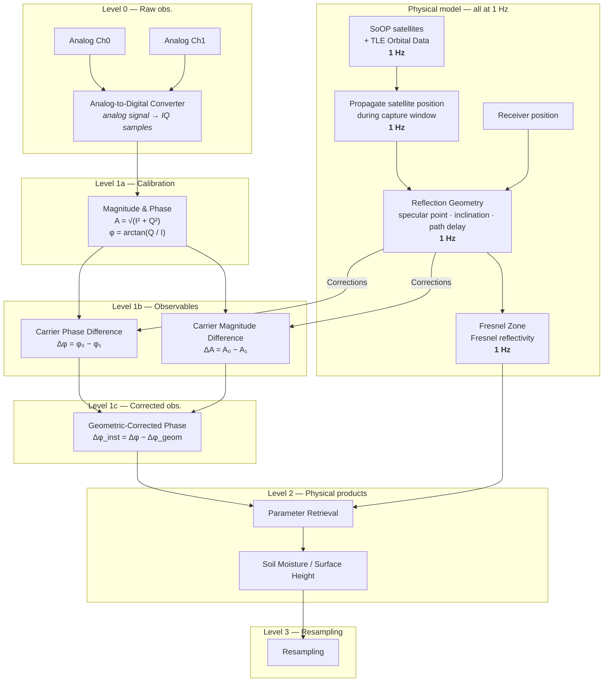

# SReTo — SDR Reflectometry Toolkit

A desktop control and analysis application for a **bistatic GNSS-R / SoOp-R**
experiment: plan which satellites are worth recording, drive a two-channel
software-defined radio to record them, and run the analysis chain over the
result.

---

## What problem this solves

**Reflectometry using Signals of Opportunity (SoOp-R)** turns other people's
satellites into a remote-sensing instrument. Navigation and communications
constellations — GPS, GLONASS, Iridium, Globalstar — continuously illuminate
the Earth with L- and S-band carriers. You do not need to transmit anything.
You need to *listen twice*:

| Channel | Antenna | What it sees |
|---|---|---|
| `rx1` | up-looking | the **direct** signal, straight from the satellite |
| `rx2` | down-looking | the same signal after it **reflected off the ground** |

The reflection is not a copy. It arrives later, weaker, and phase-shifted, and
*how* it differs is set by the surface it bounced off. Compare the two channels
and you can retrieve geophysical quantities from the difference:

- **Soil moisture** — water raises the ground's dielectric constant, which
  raises its Fresnel reflectivity. A wetter field reflects more strongly.
- **Surface height** — the extra path the reflected ray travels is a function
  of the receiver's height above the reflecting surface, so the phase
  difference measures that height (snow depth, water level, vegetation).

The measurement is cheap in hardware and expensive in **coherence and
bookkeeping**. Both channels must be sampled by the same clock, or the phase
difference is meaningless. The satellite has to actually be in a usable part of
your sky at the moment you record. The geometry of the specular point — where
on the ground the bounce happened — has to be propagated from orbital elements
for every second of the capture, or you cannot separate the *geometric* phase
change (the satellite moved) from the *surface* phase change (the thing you
want).

SReTo is the front-end for all of that bookkeeping. It does not reimplement the
science: it drives the existing pipeline, shows what is about to happen before
it happens, and makes the results reachable.

> **SReTo is a front-end, not the pipeline.** The capture scripts, the
> propagator and the analysis chain live in a separate **science repository**
> that is not bundled here. See [Requirements](#requirements) and
> [Roadmap to standalone](#roadmap-to-standalone).

---

## Download & install

**Read [Requirements](#requirements) first — one of them cannot be installed
with pip.** The 30-second version: you need Python ≥ 3.9 *with `tkinter`*, and
`tkinter` comes from the interpreter, not from a package index.

### 1. Check the interpreter you are about to use

```bash
python3 --version                     # must be 3.9 or newer
python3 -c "import tkinter; print('tkinter ok', tkinter.TkVersion)"
```

If the second command fails, fix it before going further:

| Platform | Fix |
|---|---|
| macOS (Homebrew Python) | `brew install python-tk` |
| macOS (python.org installer) | already included |
| Debian / Ubuntu | `sudo apt install python3-tk` |
| Fedora / RHEL | `sudo dnf install python3-tkinter` |
| conda | `conda install tk` |

A virtual environment **inherits `tkinter` from the interpreter it was created
with** and can never add it later, so get this right before creating the venv.

### 2. Get the source

```bash
git clone https://github.com/janepk12/SReTo.git
cd SReTo
```

Or download a source archive and unpack it — there is no build step and no
compiled extension, so a `.zip` from the Code button works identically.

### 3. Install into a virtual environment

Every path below is relative to the checkout. Nothing is written outside it
except SReTo's own state directory, and nothing is hardcoded to a home
directory.

```bash
python3 -m venv .venv
source .venv/bin/activate             # Windows: .venv\Scripts\activate
python -m pip install --upgrade pip

pip install .                         # runtime only — no third-party deps
pip install ".[all]"                  # + Pillow and macOS Location Services
pip install -e ".[dev,images]"        # editable, for working on SReTo
```

`pip install .` pulls in **nothing**: SReTo has no required third-party
dependencies. The extras are genuinely optional — see
[Requirements](#requirements) for what each one buys.

### 4. Verify the install before pointing it at anything

```bash
sreto --version          # 'sreto 0.1.0'
sreto --check            # imports every module, checks tkinter, runs the suite
sreto --radios           # which SDRs work today, and which are coming
sreto --where            # the resolved repo / state / config paths
```

`sreto --check` opens no window and touches no radio, so it is safe to run at
any time — including while a capture is in progress.

### 5. Point it at the science repository (optional)

```bash
sreto --set-repo ../sdr_r    # relative paths are accepted and resolved
sreto --where                # confirm which source the root was resolved from
```

**Without a science repository the app still opens.** Every panel that needs
one says so instead of failing silently, so you can install, look around and
decide whether it is what you want before setting anything up.

### 6. Run it

```bash
sreto                    # open the window
python -m sreto          # identical, and works without the console script
```

### Uninstall

```bash
pip uninstall sreto
rm -rf "$(sreto --where 2>/dev/null | awk '/state dir/{print $NF}')"   # optional
```

Deleting the checkout and the venv removes everything else; SReTo never writes
into the science repository, so that stays byte-identical.

### Command reference

| Command | What it does | Needs a science repo? |
|---|---|---|
| `sreto` | Open the window | no — degrades and explains |
| `sreto --check` | Imports, tkinter, and the validation suite. Headless | no |
| `sreto --where` | The resolved repo / state / config paths, and which source won | no (exits 1 without one) |
| `sreto --radios` | Supported SDRs, what is coming, and the host command for each | no |
| `sreto --set-repo PATH` | Persist the science repository location | — |
| `sreto --version` | Print the version | no |
| `python -m sreto` | Every flag above, without the console script | — |

**It opens locked.** The window builds itself, then covers itself with a
blurred lock screen and refuses to run anything until you press **`L`, then
`Enter`**. This is about consent, not security: the app drives real hardware
and fills real disks, and a stray click should not start that. `App.run_job()`
checks the lock as well as the overlay, so a panel method called from anywhere
else cannot sail past it.

### Configuration

| Variable | Default | Purpose |
|---|---|---|
| `SRETO_REPO_ROOT` | auto-detected | the science repository containing `01_CODE/` |
| `SRETO_STATE_DIR` | `~/Library/Application Support/sreto/state` (macOS), `$XDG_STATE_HOME/sreto` (Linux) | the **only** place SReTo writes |
| `SRETO_CONFIG_DIR` | `~/Library/Application Support/sreto` (macOS), `$XDG_CONFIG_HOME/sreto` (Linux) | location of `config.json` |
| `SRETO_PYTHON` | `sys.executable` | interpreter used to run the pipeline's Python tools |

The repository root is resolved from the first source that answers:
`$SRETO_REPO_ROOT` → `<config dir>/config.json` → the working directory or any
parent that looks like the science repo → the installed package's location.
`sreto --where` always names which one won, because a wrong repository is much
easier to spot when the reason it was chosen is on screen.

**Without a science repository the app still opens** and says exactly what is
missing — every panel that needs the repository reports it rather than failing
silently.

### The desktop app bundle

```bash
scripts/make_desktop_app.sh                   # double-clickable launcher
scripts/make_desktop_app.sh --icon photo.jpg  # with your own thumbnail
```

macOS gets a real `.app` bundle; Linux gets a `.desktop` launcher. On macOS the
bundle is **required** for the "This laptop" location fix — see
[Requirements](#requirements).

---

## The data processing chain

Two branches run in parallel and meet twice. The **observation branch** turns
antenna voltages into a corrected phase difference; the **physical-model
branch** (everything at **1 Hz**) computes where the satellite was, where the
specular point landed, and what the surface should reflect. The model corrects
the observations at Level 1b and supplies the reflectivity used for retrieval
at Level 2.



**Reading it as levels:**

| Level | Name | Produces |
|---|---|---|
| **0** | Raw obs. | IQ samples from both analog channels through the ADC |
| **1a** | Calibration | Per-channel magnitude `A = √(I² + Q²)` and phase `φ = arctan(Q/I)` |
| **1b** | Observables | Carrier phase difference `Δφ = φ₀ − φ₁`, carrier magnitude difference `ΔA = A₀ − A₁` |
| **1c** | Corrected obs. | Geometric-corrected phase `Δφ_inst = Δφ − Δφ_geom` |
| **2** | Physical products | Parameter retrieval → soil moisture / surface height |
| **3** | Resampling | Regularised time series |

The physical-model branch is what makes Level 1c possible. `Δφ_geom` is the
phase difference you would measure from geometry alone — a moving satellite
changes the direct-minus-reflected path length continuously, and that change
would otherwise be indistinguishable from a change in the surface. Subtracting
it is the entire point of propagating the orbit at 1 Hz for the duration of the
capture.

---

## File-by-file

### Application core

| File | What it does | Inputs | Outputs |
|---|---|---|---|
| `src/sreto/__init__.py` | Package docstring, `__version__` | — | — |
| `src/sreto/__main__.py` | CLI entry point (`sreto`): `--check`, `--where`, `--set-repo`, `--version` | argv | exit code; opens the window |
| `src/sreto/app.py` | The window, and the one place a job's whole lifecycle lives: journal start → console banner → live stream → journal end → save log → open figures → reveal output | panel callbacks, `runner` handles | run journal entries, console logs, Tk window |
| `src/sreto/config.py` | Resolves the science repository (`$SRETO_REPO_ROOT` → `config.json` → cwd → package) and the state/config directories | env vars, `config.json` | resolved paths; `missing_repo_message()` |
| `src/sreto/paths.py` | Every filesystem location, derived from `config`. Repo paths are read-only; state paths are the only writable ones | `config` | path constants, `data_dirs()`, `python_executable()` |
| `src/sreto/theme.py` | The plotting palette lifted from the pipeline's figures, plus named, scalable Tk fonts | scale factor | ttk styles, colour constants, `on_scale_change` |
| `src/sreto/widgets.py` | Reusable form pieces. `PlaceholderEntry` shows the script's own default in muted text and sends a blank line when untouched | — | Tk widgets |
| `src/sreto/branding.py` | Author, institution and asset slots; searches a writable user assets dir before the packaged one | `branding.json`, `git config user.name` | credit rows, asset paths |
| `src/sreto/credits.py` | The "About" window: same information as the lock screen plus the live runtime paths | `branding`, `paths`, `config` | Tk window |
| `src/sreto/lockscreen.py` | The consent gate. Walks the widget tree for live geometry and colours, paints them into a Pillow image and Gaussian-blurs *that* — a real blurred likeness, not a stock texture | Tk widget tree, `loading_screen.*` | overlay; unlock callback |
| `src/sreto/header.py` | The title tile: UTC and Berlin clocks side by side, plus receiver coordinates at 4 dp (copied at full precision on click) | `location`, clocks | Tk frame |
| `src/sreto/status.py` | One status model — `idle` / `busy` / `barely holding on` / `failed` — plus the traffic light and spinner. Strain is read from load average, because bladeRF streaming is real-time and a struggling machine drops samples | load average, job state | state, colour, label |

### Driving the pipeline

| File | What it does | Inputs | Outputs |
|---|---|---|---|
| `src/sreto/jobs.py` | Turns form values into invocations of the existing tools. Answers `capture.sh`'s prompts **positionally** — the contract `test_capture_contract.py` defends | form dicts | `Job` (argv, cwd, env, stdin lines, nice, output/artifact dirs) |
| `src/sreto/runner.py` | Runs the tools in a **pty, not a pipe**, so `isatty()` colour, `\r` progress bars and `read -p` prompts behave as in a terminal. Stop signals the whole process group (SIGINT → TERM → KILL) | `Job` | live byte stream, exit code, duration |
| `src/sreto/ansi_console.py` | The embedded terminal: SGR colours, `\r` line rewrites, and the pty's `ONLCR` (`\n` → `\r\n`) handled so a CRLF never erases a finished line | pty bytes | rendered Tk text; `strip_ansi()` for the saved log |
| `src/sreto/main_params.py` | Parameterises `MAIN.py` **without editing it**: reads it, rewrites the chosen assignment lines inside the `USER PARAMETERS` block only, `ast`-parses the result, writes a throwaway copy | `MAIN.py`, override dict | a runnable `.py` copy in the state dir |
| `src/sreto/radio_settings.py` | One answer to "what will this capture actually use?" — parses `soop_capture.sh` for its fixed settings and reports each with the line number it came from | `soop_capture.sh`, `presets.json` | settings table tagged by origin; forwarded flags |
| `src/sreto/radios.py` | Which SDRs are supported, which are coming, and the host command each is driven with. Pure data, so `sreto --radios`, the pre-check hints and the README cannot drift apart | — | `Radio` catalogue; `format_table()` |
| `src/sreto/prechecks.py` | Pre-flight: science repo, tools, analysis modules, radio, disk, directories, geometry, TLE age, plan age, history. Every failure carries the **fix**, not just the complaint | filesystem, `bladeRF-cli -p`, disk | `Check(name, status, detail, hint, group)` |
| `src/sreto/diagnostics.py` | Reads a failed run's actual output and names the cause, instead of guessing from the exit code | console tail, return code, job kind | headline + guidance |
| `src/sreto/system_open.py` | Opens figures and reveals folders, reusing an already-open Finder window | paths, `since_unix` | `(ok, message)`; `figures_written_since()` |
| `src/sreto/make_icon.py` | Normalises any image into the square PNG a desktop icon needs (centre-cropped, never squashed) | image file, or nothing | `app_icon.png` |

### Observation planning

| File | What it does | Inputs | Outputs |
|---|---|---|---|
| `src/sreto/soop_availability.py` | What is overhead, and when. **Provider-based**: the panel does no orbital mechanics, it asks a provider. `CapturePlanProvider` reads the real plan; `PlaceholderProvider` is synthetic and labelled | plan TSV | `SatellitePass` list, summaries |
| `src/sreto/skyview.py` | Which passes you can *actually see*. The planner masks on elevation only, so it lists passes behind your roof; this is where you declare the azimuth sectors you have a view of. Evaluates each pass over its **whole arc**, not just its peak | passes, TLEs, `HorizonMask` | in-view fraction, best visible elevation, visible window; cached az/el tracks |
| `src/sreto/skymap.py` | Polar az/el view of what is up now — zenith centre, horizon rim, north up. Pure Tk canvas, no matplotlib | cached tracks, scrub time | canvas items |
| `src/sreto/location.py` | Where the receiver is, and how stale that answer is. Three sources, one interface: plan header, `geometry.json`, or a one-shot CoreLocation fix | plan TSV header, `geometry.json`, CoreLocation | `(lat, lon, alt, source, timestamp)`; cached to `location.json` |
| `src/sreto/_lazy_orbits.py` | The single place SReTo imports the pipeline's propagator, deferred to first use so a session that never opens the mask never pays for numpy/skyfield | TLE lines, times, receiver position | elevation, azimuth, range |
| `src/sreto/history.py` | Three logs merged into one timeline: the master CSV, the failures CSV, and SReTo's own journal. Stdlib only — pandas for 45 rows would cost 0.4 s of startup | master CSV/JSONL, failures CSV, `runs.jsonl` | merged rows, stats, data volume; **appends** to `runs.jsonl` |

### Tabs

| File | Wraps | Notes |
|---|---|---|
| `src/sreto/panels/capture_panel.py` | `capture.sh` | Every field optional — blank sends a blank line, which is how the script selects its own default. Live size estimate uses the script's own arithmetic |
| `src/sreto/panels/automation_panel.py` | `soop_capture.sh`, `soop_planner.py` | Blank fields emit no flag at all. List / dry-run are first-class |
| `src/sreto/panels/analysis_panel.py` | `MAIN.py` | Fields load *from* `MAIN.py`, so the form shows what `python MAIN.py` would do right now. Pre-flight memory estimate |
| `src/sreto/panels/availability_panel.py` | plan TSV | Providers, the sky-view mask compass, the live skymap, and the settings a capture started here will use |
| `src/sreto/panels/history_panel.py` | master logs + journal | Colour-coded; rows predating `Capture_Status` show UNKNOWN, never SUCCESS |
| `src/sreto/panels/precheck_panel.py` | — | Runs `prechecks.run_all` on a worker thread, streaming results section by section |

### Tests & project files

| File | What it does |
|---|---|
| `tests/test_nondestructive.py` | Hashes every file in the science repo, exercises SReTo's whole non-hardware surface, hashes again. Also asserts the package and state dir live **outside** the repo |
| `tests/test_capture_contract.py` | Parses `capture.sh` for its prompt order and defaults and `soop_capture.sh` for its accepted flags, then compares with what `jobs.py` sends |
| `tests/test_radio_settings.py` | Every displayed value matches the script line it claims to come from; only parsable flags are emitted; a split rx1/rx2 gain is never flattened |
| `tests/test_main_params.py` | The `MAIN.py` parameterisation changes only the lines it claims to, and `MAIN.py` is never opened for writing |
| `tests/test_theme_matches_plots.py` | Re-parses the plotting modules and compares every shared colour constant with `theme.py` |
| `tests/test_skyview.py` | Sector geometry at the 0°/360° wrap, per-sector elevation floors, the cache |
| `tests/test_components.py` | Availability providers, the ANSI parser, history merging, capture size estimates |
| `tests/test_diagnostics.py` | Failure reporting, tested against a real failing run's verbatim output |
| `tests/test_radios.py` | The radio catalogue is well-formed, and a single-channel device can never be listed as supported or merely pending |
| `tests/test_opens_without_repo.py` | Builds the real window with **no science repository** — the one combination (a display *and* no repo) that every other test misses, and exactly what a new install has |
| `tests/test_ui_features.py` | Zoom, the status model, constellation identity, the skymap projection, the location cache |
| `tests/support.py` | `requires_science_repo` / `requires_display` decorators, so environment-dependent tests **report as skipped** rather than silently passing |
| `tests/run_tests.py` | The suite without pytest (`python -m tests.run_tests`, `sreto --check`) |
| `scripts/make_desktop_app.sh` | Builds a macOS `.app` bundle or a Linux `.desktop` launcher |
| `scripts/dev_launch.sh` | Source-checkout launcher that finds a conda interpreter with tkinter |

---

## Input and output formats

Verified against the code, not assumed.

### Read

| Format | Path | Read by | Contents |
|---|---|---|---|
| `.bin` | `02_DATA/*.bin` | `system_open.newest_captures`, `analysis_panel` | Raw interleaved IQ samples written by `capture.sh`. Gigabytes each — never enters this repository |
| `.json` (sidecar) | `02_DATA/<same-stem>.json` | `system_open`, `analysis_panel`, `diagnostics` | Per-capture metadata. A `.bin` without its sidecar is not offered for analysis |
| `.tsv` | `03_FIGURES/SOOP_AVAILABILITY/latest_capture_plan.tsv` | `soop_availability`, `location`, `skyview` | The capture plan. 15 tab-separated columns: `rise_unix`, `set_unix`, `peak_unix`, `duration_s`, `peak_el_deg`, `freq_mhz`, `samplerate_mhz`, `bandwidth_mhz`, `geo`, `catnr`, `name`, `rise_utc`, `set_utc`, `tle_line1`, `tle_line2`. The header also carries the receiver coordinates and the elevation mask |
| `.csv` | `02_DATA/master_experiment_log.csv` | `history` | One row per `capture.sh` run |
| `.csv` | `02_DATA/master_failures.csv` | `history` | Short/overrun captures |
| `.jsonl` | `02_DATA/master_experiment_log.jsonl` | `history` | The same log, one JSON object per line |
| `.json` | `01_CODE/geometry.json` | `location`, `prechecks` | The configured receiver position `MAIN.py` uses |
| `.json` | `01_CODE/.tle_cache.json` | `prechecks` | Cached CelesTrak TLEs; staleness is checked, not the contents |
| `.sh` / `.py` | `01_CODE/capture.sh`, `soop_capture.sh`, `MAIN.py`, `waterfalls.py`, `iq_dashboard.py` | `jobs`, `radio_settings`, `main_params`, tests | **Parsed as text**, never executed for their values — prompts, flags, fixed settings and colour constants are re-derived from the source |

### Written

Everything SReTo writes goes under the state directory. It never writes into
the science repository.

| Format | Path | Written by | Contents |
|---|---|---|---|
| `.jsonl` | `<state>/runs.jsonl` | `history.append_journal` | The run journal: one `start` and one `end` object per run, with kind, command, duration, exit code and verdict |
| `.json` | `<state>/presets.json` | `app`, `radio_settings`, `availability_panel` | Last-used form values, the UI scale, and the horizon mask (it describes a physical site, not a session) |
| `.json` | `<state>/location.json` | `location` | The cached receiver fix with its timestamp |
| `.json` | `<state>/skyview_cache.json` | `skyview` | Propagated az/el tracks, versioned; independent of the mask so re-masking is instant |
| `.log` | `<state>/logs/<stamp>_<kind>_<id>.log` | `app._save_run_log` | Plain-text console output, ANSI stripped |
| `.py` | `<state>/tmp/MAIN_gui_<stamp>.py` | `main_params.write_run_copy` | The transpiled `MAIN.py` copy that actually runs |
| `.json` | `<config>/config.json` | `config.set_repo_root` | `{"repo_root": "…"}` |
| `.png` | `<user assets>/app_icon.png` | `make_icon` | The desktop icon |

### Opened, not written

`.png`, `.jpg`, `.jpeg`, `.pdf`, `.svg` — figures the pipeline wrote into
`03_FIGURES/`, handed to the desktop. Only figures written *since the run
started* are opened, and only for a run that **succeeded**: a failed run's
partial figures are named in the console rather than displayed, because
presenting a partial pipeline as a result is worse than showing nothing.

---

## Requirements

Requirements here are graded, because most of SReTo works with almost none of
them. **Only the first two are needed to install and open the app.**

| # | Requirement | Needed for | Hard? |
|---|---|---|---|
| 1 | **Python ≥ 3.9** | installing at all | **required** |
| 2 | **`tkinter`** for that interpreter | opening the window | **required** — cannot be pip-installed |
| 3 | A **science repository** (`$SRETO_REPO_ROOT`) | capture, planning, analysis | required for real work |
| 4 | **`bladeRF-cli`** on `PATH` | capture only | required to capture |
| 5 | A **Nuand bladeRF** + two antennas | capture only | required to capture |
| 6 | ≥ **5 GB** free disk | a capture session | required to capture |
| 7 | **Pillow** | the blurred lock screen, `sreto.make_icon` | optional, degrades cleanly |
| 8 | **pyobjc-framework-CoreLocation** | "This laptop" coordinates on macOS | optional, degrades cleanly |

Check the whole list at once — this is exactly what the pre-flight panel runs,
and it names the fix for every failure rather than just the complaint:

```bash
sreto --check
```

### Software

| Requirement | Notes |
|---|---|
| **Python ≥ 3.9** | CI covers 3.11 and 3.12 on macOS and Linux. No compiled extension, so any CPython in range works |
| **tkinter** | Ships with the python.org installers but **cannot be pip-installed**. macOS: `brew install python-tk`. Debian/Ubuntu: `sudo apt install python3-tk`. Fedora: `sudo dnf install python3-tkinter`. conda: `conda install tk`. A venv inherits it from its base interpreter and cannot acquire it afterwards |
| **Pillow** *(optional)* | `pip install "sreto[images]"`. Without it the lock screen degrades to a plain scrim and `sreto.make_icon` refuses to run — both paths are guarded with `try/except ImportError` |
| **pyobjc-framework-CoreLocation** *(optional, macOS)* | `pip install "sreto[macos]"`. Only for the "This laptop" coordinate fix, and only useful from the `.app` bundle — see below |
| The **science repository** | Not bundled. Its own environment supplies numpy, scipy, matplotlib, skyfield and the bladeRF bindings |

SReTo itself has **no required third-party dependencies**. That is deliberate,
not an oversight: `numpy`, `matplotlib`, `scipy` and `skyfield` are never
imported by this package. The analysis runs in a subprocess under the science
repository's own interpreter, and `prechecks.py` merely verifies those modules
are importable *there*. Point `$SRETO_PYTHON` at that interpreter when SReTo is
installed in its own virtual environment:

```bash
export SRETO_PYTHON=/path/to/science-env/bin/python
sreto --where            # confirms which interpreter will run the pipeline
```

### Hardware

| Item | Notes |
|---|---|
| **Nuand bladeRF** | Dual-channel **coherent** RX. Both channels must share one clock — separate receivers cannot measure a phase difference. See [Supported radios](#supported-radios) for what else is coming |
| Up-looking antenna → `rx1` | The direct signal |
| Down-looking antenna → `rx2` | The ground-reflected signal |
| `bladeRF-cli` on `PATH` | `capture.sh` calls it by name; SReTo only checks that it exists and probes it |
| Disk headroom | ≥ 5 GB free before a session (the threshold `soop_capture.sh` itself uses). Captures are gigabytes |

SReTo never talks to the radio itself — `capture.sh` does. The only hardware
interaction here is a `bladeRF-cli -p` probe in the pre-checks, and the
pre-check panel has a checkbox to skip even that.

**No radio, no repository, no problem — for everything except capture.** The
window opens, every tab builds, the theme, zoom, lock screen, skymap
projection, ANSI console and diagnostics all work with nothing plugged in.

### macOS: Location Services needs the `.app` bundle

**"This laptop" coordinates only work when launched from the `.app` bundle**,
not from a bare `sreto` in a terminal. macOS keys the Location Services
permission to a **bundle identifier**; a bare interpreter process has none, so
there is no setting in System Settings that can grant it access. This is not a
bug and not something to look harder for.

`scripts/make_desktop_app.sh` builds a real `.app` with the required
`NSLocationWhenInUseUsageDescription` key in its `Info.plist`; launch from that
and the permission prompt appears once. Run from a terminal, the header tile
says so and falls back to the plan header or `geometry.json` coordinates —
which is what almost every session wants anyway, since the antenna does not
move.

If the repository lives under `~/Desktop`, `~/Documents` or `~/Downloads`, a
freshly built unsigned `.app` is also subject to macOS TCC and may be denied
file access silently. The generated launcher surfaces any startup failure as a
real alert rather than a Dock icon that bounces once; the fix is to grant Full
Disk Access to the interpreter, or move the repository.

---

## Supported radios

```bash
sreto --radios     # the same table, from the app, always current
```

The catalogue behind that command lives in
[`src/sreto/radios.py`](src/sreto/radios.py) as data, so this section, the
pre-check hints and the CLI cannot drift apart.

### The constraint that decides everything

SReTo measures a **carrier phase difference between two antennas**. That is
only meaningful if both channels are sampled by **one clock and one PLL**. Two
receivers, however carefully disciplined to a shared PPS, drift in carrier
phase — and once they do, the difference stops being a property of the ground
and starts being a property of your two oscillators.

So a radio is one of two things, and no amount of future work moves it between
them:

| | |
|---|---|
| **Coherent pair** — two RX chains, one reference | the full measurement, Level 0 → Level 3 |
| **Single channel** — one RX chain | pass planning, direct-only recording, replaying and analysing existing captures. **Never** a phase difference |

A single-tuner SDR is therefore listed as *limited*, not as *pending*. Calling
it "coming soon" would be a promise the physics does not allow.

### Support matrix

| `--radio` | Device | Coherent RX | Status |
|---|---|---|---|
| `bladerf` | Nuand bladeRF x40 / x115 / 2.0 micro | 2 ch | ✅ **supported today** |
| `usrp` | Ettus USRP B210 / N210 (UHD) | 2 ch | 🚧 in progress |
| `rspduo` | SDRplay RSPduo (dual-tuner mode) | 2 ch | 📋 coming soon |
| `pluto` | ADALM-Pluto (AD9361) | 2 ch † | 📋 coming soon |
| `limesdr` | LimeSDR USB (**not** the Mini) | 2 ch | 📋 coming soon |
| `krakensdr` | KrakenSDR — 5× coherent RTL-SDR | 5 ch | 📋 coming soon |
| `soapy` | Any SoapySDR device (generic backend) | device-dependent | 📋 coming soon |
| `rtlsdr` | RTL-SDR (RTL2832U) | 1 ch | ⚠️ limited — no phase difference |
| `hackrf` | HackRF One | 1 ch | ⚠️ limited — no phase difference |
| `airspy` | Airspy R2 / Mini | 1 ch | ⚠️ limited — no phase difference |

† The AD9361 in a Pluto is a 2×2 part, but a stock unit exposes one RX chain
until it is re-flashed to the 2r2t firmware. Support means documenting that
step, not working around it.

### What changes per radio

Each backend swaps out one thing: **the host tool and its command line**.
Everything above it — the plan TSV, the pass selection, the sky-view mask, the
run journal, the analysis chain — is unchanged. The commands below are written
for 1575.42 MHz (GPS L1) at 2 Msps so they can be compared line for line.

<!-- Kept in sync with src/sreto/radios.py; `sreto --radios` prints the same. -->

| Radio | Probe | Capture |
|---|---|---|
| **bladeRF** ✅ | `bladeRF-cli -p` | `bladeRF-cli -e "set frequency rx 1575420000" -e "set samplerate rx 2000000" -e "set bandwidth rx 1000000" -e "rx config file=capture.bin format=bin n=20M channel=1,2" -e "rx start" -e "rx wait"` |
| **USRP** 🚧 | `uhd_find_devices` | `rx_samples_to_file --args "type=b200" --freq 1575.42e6 --rate 2e6 --bw 1e6 --gain 40 --channels 0,1 --file capture.dat --duration 10` |
| **RSPduo** 📋 | `SoapySDRUtil --probe="driver=sdrplay"` | `rx_sdr -d driver=sdrplay,mode=Dual -f 1575420000 -s 2000000 -b 1000000 -g 40 -n 20000000 capture.bin` |
| **Pluto** 📋 | `iio_info -u ip:192.168.2.1` | `iio_attr -u ip:192.168.2.1 -c ad9361-phy RX_LO frequency 1575420000 && iio_readdev -u ip:192.168.2.1 -b 65536 -s 20000000 cf-ad9361-lpc > capture.bin` |
| **LimeSDR** 📋 | `LimeUtil --find` | `rx_sdr -d driver=lime -f 1575420000 -s 2000000 -b 1000000 -g 40 -n 20000000 capture.bin` |
| **KrakenSDR** 📋 | `python3 -m krakensdr.daq --list` | `heimdall_daq -c daq_chain_config.ini` |
| **SoapySDR** 📋 | `SoapySDRUtil --find` | `rx_sdr -d driver=<name> -f 1575420000 -s 2000000 -b 1000000 -g 40 -n 20000000 capture.bin` |
| **RTL-SDR** ⚠️ | `rtl_test -t` | `rtl_sdr -f 1575420000 -s 2048000 -g 40 -n 20480000 capture.bin` |
| **HackRF** ⚠️ | `hackrf_info` | `hackrf_transfer -r capture.bin -f 1575420000 -s 8000000 -a 1 -l 32 -g 16` |
| **Airspy** ⚠️ | `airspy_info` | `airspy_rx -r capture.bin -f 1575.42 -a 10000000 -t 0 -g 17` |

Host packages each backend would need:

| Radio | Install |
|---|---|
| bladeRF | bladeRF host tools (`libbladeRF`) |
| USRP | UHD host driver, then `uhd_images_downloader` |
| RSPduo | SDRplay API v3, `SoapySDRPlay3`, `rx_tools` |
| Pluto | `libiio`, plus the 2r2t firmware for the second RX chain |
| LimeSDR | `LimeSuite`, `SoapySDR`, `rx_tools` |
| KrakenSDR | Heimdall DAQ firmware, the Kraken fork of `librtlsdr` |
| SoapySDR | `SoapySDR`, the device's Soapy module, `rx_tools` |
| RTL-SDR | `librtlsdr` |
| HackRF | `hackrf` host tools |
| Airspy | `airspy` host tools |

### Honest notes on each

- **USRP B210** is the most direct substitute and the reason it is first: two
  coherent RX channels by design, and UHD exposes the same
  frequency/rate/bandwidth/gain knobs `capture.sh` already asks for. The
  remaining work is a sample-format shim — UHD writes `sc16`, the pipeline
  reads bladeRF's interleaved `bin`.
- **RSPduo** is genuinely coherent in dual-tuner mode and far cheaper than a
  USRP. It is behind UHD only because it needs the proprietary `sdrplay_api`
  service running.
- **LimeSDR Mini has one RX chain.** Only the full-size USB board can make the
  measurement. This catches people out often enough to be worth stating twice.
- **KrakenSDR** is five coherent channels behind one noise-source calibration.
  Overkill for two antennas, but it is the cheapest coherent hardware that
  exists, and it would make this experiment reproducible on a hobby budget.
- **SoapySDR** is the escape hatch: one backend covering Lime, SDRplay, Airspy
  and others at once — at the cost of only reaching the settings SoapySDR
  exposes, which does *not* include the bias-tee and per-chain AGC that
  `capture.sh` asks about today.
- **RTL-SDR, HackRF and Airspy** are survey radios here. Use them to confirm an
  illuminator is where the planner said it would be. Airspy additionally stops
  tuning below 1.8 GHz, so it reaches L-band GNSS but none of the S-band SoOp
  targets.

### What "coming soon" means concretely

`--radio` **is not a flag yet.** Today `capture.sh` in the science repository
talks to `bladeRF-cli` directly, and swapping radios means a capture-backend
interface that does not exist. That work is step 3 of the
[roadmap](#roadmap-to-standalone), and the shape it needs is:

```text
sreto --radios                     # ✅ works today — the table above
sreto --radio usrp --check         # 📋 planned: probe a specific backend
sreto --radio usrp                 # 📋 planned: open with that backend selected
sreto --set-radio usrp             # 📋 planned: persist the choice, like --set-repo
```

Only the first line exists. The other three are printed here so the interface
is agreed before it is built, not discovered afterwards — and `sreto --radios`
says the same thing at the bottom of its output rather than letting you find
out by typing one.

---

## Roadmap to standalone

**Today SReTo installs cleanly and opens on any machine, but it cannot capture
or analyse without the science repository.** That is the honest status. The
structure needed to close the gap is already in place — `config.py` makes every
external dependency explicit and configurable, and nothing is hardcoded to an
absolute path — so what remains is genuinely about moving code, not
re-architecting.

### What already works standalone

- Installs from `pyproject.toml`; `pip install .` gives a working `sreto` command.
- The window opens, every tab builds, the theme, zoom, lock screen, skymap
  projection, ANSI console and diagnostics all work with no repository present.
- The repo-independent half of the test suite runs anywhere, including
  headless CI.
- A missing repository is reported clearly everywhere it matters, instead of
  raising `ImportError: orbits` or `FileNotFoundError` on an absolute path.

### What still requires the science repository

| Gap | Currently provided by | What standalone needs |
|---|---|---|
| **Capture execution** | `01_CODE/capture.sh` (bladeRF streaming, sidecar JSON, master-log rows) | Either vendor the script, or define a capture-backend interface with the script as one implementation |
| **Automated sessions** | `01_CODE/soop_capture.sh` | Same; also the fixed-settings block `radio_settings.py` parses out of it |
| **Pass planning** | `01_CODE/soop_planner.py` (writes the plan TSV) | A planner in-package, or a documented plan-TSV contract so any planner can feed SReTo |
| **Orbit propagation** | `01_CODE/orbits.propagate_satellite` via `_lazy_orbits.py` | The one dependency worth vendoring first: it is small, `_lazy_orbits.py` is already the single seam, and it would need only `skyfield`/`sgp4` |
| **Analysis chain** | `01_CODE/MAIN.py` + `waterfalls`, `iq_dashboard`, `band_correlator`, `physics`, `fresnel`, `satellites`, `sdr_core`, `console` | The largest piece. Levels 1a–3 of the chain above live here |
| **Colour-constant test** | parses `waterfalls.py` / `iq_dashboard.py` | A shared palette module both sides import |
| **Receiver geometry** | `01_CODE/geometry.json` | A first-run setup dialog writing to the state dir |
| **Data layout** | the `02_DATA/` and `03_FIGURES/` trees | Configurable data/figure roots, not just a repo root |

### Ordered plan

1. **Vendor the propagator.** Smallest dependency, cleanest seam, unlocks the
   sky-view mask and skymap without any repository at all.
2. **Formalise the plan TSV as a documented contract** (the 15 columns are
   already stable and parsed in one place) so a third-party planner can drive
   SReTo.
3. **Extract a capture-backend interface** with `capture.sh` as one
   implementation and a file-replay backend as another — that alone makes the
   whole app demonstrable without hardware, and it is the seam every entry in
   [Supported radios](#supported-radios) is waiting on.
4. **Move receiver geometry into a first-run dialog** writing to the state dir.
5. **Port the analysis chain**, level by level, following the diagram above.

Steps 1–4 would make SReTo installable, openable and *usable against existing
captures* by someone who only downloaded this repository. Step 5 is a project
in its own right.

---

## Design notes worth knowing

A few decisions that look arbitrary and are not:

- **The console is a pty, not a pipe.** The pipeline's own `console.py` and
  `soop_capture.sh` gate colour on `isatty()`; `capture.sh` draws a progress bar
  with `\r` and asks its parameters with `read -p`, which writes to the tty.
  Through a pipe all four break.
- **Stop signals the whole process group** (SIGINT → TERM → KILL). `capture.sh`
  backgrounds `bladeRF-cli`, so killing only the shell would leave the radio
  streaming.
- **Every font is a *named* Tk font**, never a `(family, size)` tuple. A tuple
  is copied into a widget at construction and frozen there; a named font stays
  live, so one reconfigure rescales a window full of widgets and a half-filled
  capture form survives a zoom.
- **The third traffic-light state (`barely holding on`) is not decoration.**
  bladeRF streaming is real-time: if the machine cannot keep up, the radio drops
  samples and `capture.sh` writes a SHORT file. Load per core is a cheap, honest
  early warning for exactly that.
- **Constellation colours deliberately exclude the `rx1`/`rx2` blue and
  orange.** Those two colours mean *channel* everywhere else in this project,
  and a satellite dot in either would read as one.
- **`--gain` sets both RX chains**, so a split rx1/rx2 gain cannot be forwarded
  to `soop_capture.sh` at all. It is refused and explained rather than silently
  flattened onto both chains, which would corrupt the direct/reflected ratio the
  experiment measures.

---

## Troubleshooting

Start with `sreto --check`. It imports every module, verifies `tkinter`, prints
the resolved paths and runs the suite — most of the table below is something it
will simply tell you.

| Symptom | Cause | Fix |
|---|---|---|
| `ModuleNotFoundError: No module named '_tkinter'` | The interpreter was built without Tk | `brew install python-tk` / `sudo apt install python3-tk`, then **recreate the venv** — an existing one cannot acquire it |
| `sreto: command not found` | The venv is not active, or the install was `--user` without its bin dir on `PATH` | `source .venv/bin/activate`, or use `python -m sreto` |
| `sreto --where` exits 1 | No science repository configured | Expected without one. `sreto --set-repo ../sdr_r` |
| Every panel says the repository is missing | The root resolved to the wrong place | `sreto --where` names *which source* won — env var, `config.json`, cwd, or package |
| Pre-checks: `bladeRF-cli not on PATH` | Host tools missing, or the science env is not active | Install the bladeRF host tools, or `conda activate sdrr`. Different radio? `sreto --radios` |
| The window opens and will not do anything | It opens **locked**, on purpose | Press `L`, then `Enter` |
| Lock screen is a flat panel, not a blur | Pillow is not installed | `pip install "sreto[images]"` — the blur is cosmetic, nothing else changes |
| "This laptop" coordinates unavailable on macOS | A bare interpreter has no bundle identity, so Location Services cannot be granted | Launch from the `.app` built by `scripts/make_desktop_app.sh`, or use the plan-header / `geometry.json` coordinates |
| Analysis fails with `ImportError: numpy` | `$SRETO_PYTHON` points at SReTo's venv, not the science env | `export SRETO_PYTHON=/path/to/science-env/bin/python` |
| `pytest` reports mostly skips | No science repository and/or no display | Expected. `pytest -ra` prints the reason for every skip |
| A capture writes a SHORT file | The machine could not keep up with real-time streaming | Watch the traffic light — `barely holding on` is the early warning. Lower the sample rate or close other work |

---

## License

[MIT](LICENSE) © Luke Pugin

The GFZ mark is **not** bundled — `src/sreto/assets/README.md` documents the
slot to drop it into. Inventing or redistributing an institution's logo is not
something a build script should do.
