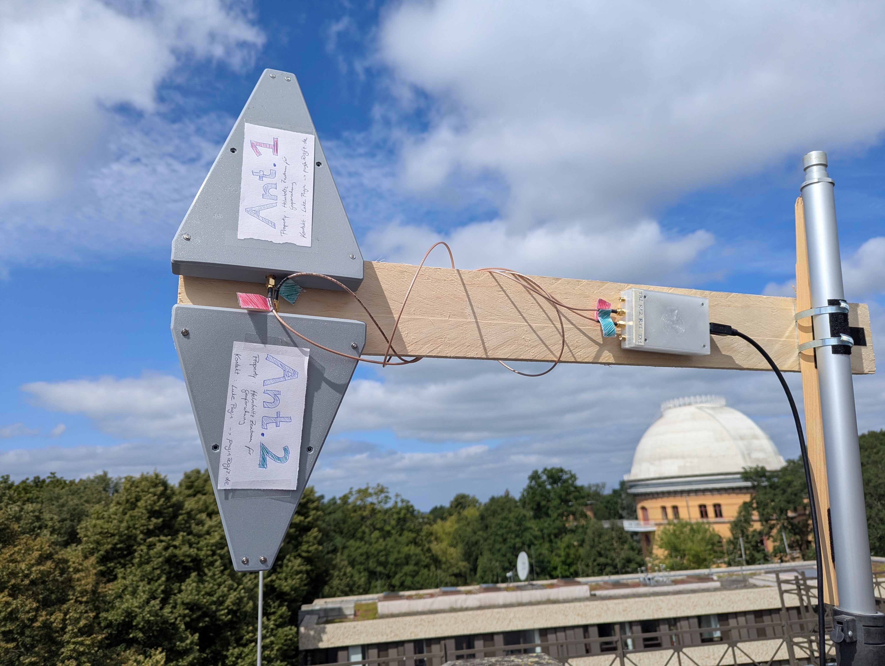
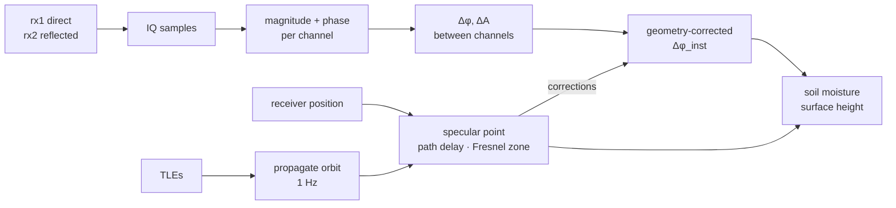

# SReTo — SDR Reflectometry Toolkit

**Plan which satellites are worth recording, record them properly, and keep
track of what you recorded.**

SReTo is a desktop app for running a **bistatic SoOp-R** experiment:
pointing two antennas at the sky and the ground, catching signals from
satellites that were never meant for you, and measuring what the ground did to
them.



<sub>A session on Tempelhofer Feld, Berlin. **Ant.1** looks up at the satellite,
**Ant.2** looks down at the grass. One mast, one radio, one clock — which is the
whole trick.</sub>

---

## The idea in one minute

GPS, GLONASS, Iridium and Globalstar are already flooding the Earth with L- and
S-band carriers. You don't transmit anything. You **listen twice**:

| Channel | Antenna | Sees |
|---|---|---|
| `rx1` | up-looking | the **direct** signal from the satellite |
| `rx2` | down-looking | the same signal after it **bounced off the ground** |

The reflection arrives later, weaker and phase-shifted, and *how* it differs is
set by the surface it hit. Wet soil reflects more strongly than dry. The extra
path length tells you the height of the surface — snow depth, water level,
vegetation.

The catch is that both channels must be sampled by **one clock**. Two separate
receivers drift apart, and then you are measuring your oscillators instead of
the ground.

### Where SReTo puts its effort

**Acquisition planning and capture come first.** The hard, unglamorous part of
this experiment is knowing *which* satellite is worth recording, *when* it is
actually visible from where you are standing, and getting the radio to capture
it cleanly without dropping samples. That is what SReTo is good at today:

- which passes are coming, and which ones you can really see past your roofline
- a live sky map of what is overhead right now
- driving the radio with settings you can see before you commit
- a log of every capture, so a session six weeks ago is still readable

**The physics model is deliberately second — for now.** Specular-point
geometry, Fresnel reflectivity, the phase corrections and the soil-moisture /
surface-height retrieval currently live in a separate science repository that
SReTo drives as a subprocess. **They are being brought into the app**, and the
plan is to visualise them properly — the specular point tracking across the
ground, the Fresnel zone, the corrections as they are applied — rather than
leaving them as numbers in a log. See [Roadmap](#roadmap).

---

## Quick start

```bash
# 1. You need Python 3.9+ WITH tkinter. Check before anything else:
python3 -c "import tkinter; print('ok', tkinter.TkVersion)"

# 2. Get it and install it
git clone https://github.com/janepk12/SReTo.git
cd SReTo
python3 -m venv .venv && source .venv/bin/activate
pip install .

# 3. Check the install, then run
sreto --check
sreto
```

**If step 1 failed**, fix it before making the venv — a virtual environment
inherits `tkinter` from the interpreter that created it and can never add it
later:

| Platform | Fix |
|---|---|
| macOS (Homebrew) | `brew install python-tk` |
| macOS (python.org) | already included |
| Debian / Ubuntu | `sudo apt install python3-tk` |
| Fedora / RHEL | `sudo dnf install python3-tkinter` |
| conda | `conda install tk` |

> **Linux: don't build the venv on conda's Python.** Conda ships its own Tk
> compiled **without Xft**, which limits it to the legacy X11 core fonts — the
> window then renders in a chunky bitmap face and looks broken, while nothing
> actually is. Nothing errors, so there is nothing to search for. Build the
> venv from the system interpreter instead:
>
> ```bash
> sudo apt install python3-tk        # once
> /usr/bin/python3 -m venv .venv     # NOT conda's python
> ```
>
> `sreto --check` prints the fonts it resolved and warns if you are on such a
> Tk, so you can confirm this in one command.

> **The window opens locked.** It builds itself, then covers itself with a
> blurred lock screen and refuses to run anything until you press **`L`, then
> `Enter`**. That is about consent, not security: the app drives real hardware
> and fills real disks, and a stray click shouldn't start that.

### Try it without any hardware

`pip install .` pulls in **no third-party packages at all**, and the app opens
with no radio and no science repository attached. Every panel that needs
something missing says so plainly. Install it, click around, then decide.

---

## What you need

Only the first two are needed to install and open the app.

| | Requirement | For | |
|---|---|---|---|
| 1 | **Python ≥ 3.9** | installing | **required** |
| 2 | **tkinter** | opening the window | **required** — not pip-installable |
| 3 | **Science repository** | capture, planning, analysis | required for real work |
| 4 | **Nuand bladeRF** + `bladeRF-cli` | capturing | required to capture |
| 5 | Two antennas, ≥ 5 GB free disk | capturing | required to capture |
| 6 | **Pillow** | the blurred lock screen | optional |
| 7 | **pyobjc-CoreLocation** | "this laptop" coordinates (macOS) | optional |

```bash
pip install ".[all]"     # everything optional, in one go
sreto --check            # checks all of the above and names the fix for each
```

**The science repository is not bundled.** The capture scripts, the pass
planner and the analysis chain live in a separate repo. Point SReTo at it once:

```bash
sreto --set-repo ../sdr_r
sreto --where               # confirms what it resolved, and from where
```

---

## Commands

| Command | Does |
|---|---|
| `sreto` | Open the window |
| `sreto --check` | Verify the install. Headless, touches no radio — safe any time |
| `sreto --where` | Which repo / state / config paths resolved, and why |
| `sreto --radios` | Which SDRs work today and which are coming |
| `sreto --set-repo PATH` | Remember where the science repository is |
| `sreto --version` | Print the version |

`python -m sreto` works identically if the console script isn't on your `PATH`.

### Make it double-clickable

```bash
scripts/make_desktop_app.sh                   # .app on macOS, .desktop on Linux
scripts/make_desktop_app.sh --icon photo.jpg  # with your own thumbnail
```

On macOS the bundle is **required** for "this laptop" coordinates: macOS keys
Location Services to a bundle identifier, and a bare interpreter in a terminal
has none — so there is no setting that can grant it. Run from a terminal and
SReTo falls back to the plan header or `geometry.json`, which is what most
sessions want anyway since the antenna doesn't move.

---

## Inside the app

| Tab | What you do there |
|---|---|
| **SoOp availability** | What's overhead and when. Sky map, and a horizon mask for the directions you can actually see |
| **Capture** | One recording, with a live size estimate before you start |
| **Automation** | Unattended sessions — record every good pass for the next N hours |
| **Analysis** | Run the processing chain over a capture |
| **History** | Every run ever, merged from the capture logs and SReTo's own journal |
| **Pre-checks** | Radio, disk, plan age, TLE age — each failure names its fix |

**SReTo never writes into the science repository** — enforced by a test that
hashes every file in that repo before and after exercising the whole app. Its
journal, presets and logs go to its own state directory; captures and figures
go wherever [the output section](#where-output-goes) says.

---

## Supported radios

The measurement needs **two RX channels on one clock**. A single-tuner radio
can plan passes and record the direct signal, but it can never produce a phase
difference — so those are marked *limited*, not *coming soon*.

| Device | Coherent RX | Status |
|---|---|---|
| Nuand bladeRF | 2 ch | ✅ **works today** |
| Ettus USRP B210 / N210 | 2 ch | 🚧 in progress |
| SDRplay RSPduo · ADALM-Pluto · LimeSDR USB · KrakenSDR | 2–5 ch | 📋 coming soon |
| Any SoapySDR device | varies | 📋 coming soon |
| RTL-SDR · HackRF · Airspy | 1 ch | ⚠️ survey only — no phase difference |

```bash
sreto --radios     # the full table, with the exact command each radio needs
```

---

## How the measurement works

Two branches, meeting twice. The **observation** branch turns antenna voltages
into a phase difference; the **model** branch works out where the satellite was
and where the bounce happened, then corrects the observation with it.



Subtracting `Δφ_geom` is the entire point of propagating the orbit at 1 Hz: a
moving satellite changes the direct-minus-reflected path length continuously,
and without removing that you cannot tell a moving satellite from a changing
surface.

<details>
<summary>The processing levels, in detail</summary>

| Level | Name | Produces |
|---|---|---|
| **0** | Raw | IQ samples from both channels through the ADC |
| **1a** | Calibration | Per-channel `A = √(I²+Q²)`, `φ = arctan(Q/I)` |
| **1b** | Observables | `Δφ = φ₀ − φ₁`, `ΔA = A₀ − A₁` |
| **1c** | Corrected | `Δφ_inst = Δφ − Δφ_geom` |
| **2** | Physical | Retrieval → soil moisture / surface height |
| **3** | Resampling | Regularised time series |

Levels 1c–3 and the whole model branch currently run in the science
repository. Bringing them into the app, with proper visualisation, is the
main line of the roadmap below.

</details>

---

## Roadmap

Today SReTo installs and opens anywhere, but it needs the science repository to
capture or analyse. Closing that gap is about moving code, not redesigning —
nothing is hardcoded to an absolute path and every external dependency is
already explicit.

1. **Vendor the orbit propagator** — smallest piece, cleanest seam, and it
   unlocks the sky map and horizon mask with no repository at all.
2. **Document the capture-plan format** so any planner can drive SReTo.
3. **Extract a capture-backend interface**, with a file-replay backend as the
   second implementation — that alone makes the app demonstrable with no
   hardware, and it is what every radio in the table above is waiting on.
4. **First-run setup dialog** for receiver geometry.
5. **Bring the physics model in, and visualise it** — specular point tracks,
   Fresnel zones, the corrections as they are applied, and the Level 2
   retrieval. This is the big one, and the reason the app exists in the shape
   it does.

Steps 1–4 make SReTo usable against existing captures by someone who only
downloaded this repository. Step 5 is a project in its own right.

---

## Troubleshooting

`sreto --check` diagnoses most of this for you.

| Symptom | Fix |
|---|---|
| `No module named '_tkinter'` | Install tkinter (see [Quick start](#quick-start)), then **recreate the venv** |
| GUI looks like a chunky terminal font (Linux) | Your Tk has no Xft — almost always a venv built on conda's Python. Rebuild it with `/usr/bin/python3 -m venv .venv`. `sreto --check` confirms it |
| `sreto: command not found` | `source .venv/bin/activate`, or use `python -m sreto` |
| Window opens but does nothing | It's locked. Press `L`, then `Enter` |
| Every panel says the repo is missing | `sreto --where` names which source it resolved from |
| `bladeRF-cli not on PATH` | Install the bladeRF host tools, or activate your science env |
| Lock screen is flat, not blurred | `pip install "sreto[images]"` — cosmetic only |
| No "this laptop" coordinates (macOS) | Launch from the `.app`; a bare terminal process can't be granted Location Services |
| CoreLocation gives no fix | A Mac has no GPS — it locates itself by scanning Wi-Fi. Turn Wi-Fi on; Ethernet is not enough |
| Analysis fails with `ImportError: numpy` | `export SRETO_PYTHON=/path/to/science-env/bin/python` |
| A capture came out SHORT | The machine couldn't keep up. Watch for `barely holding on`; lower the sample rate |

---

## Configuration

| Variable | Default | Purpose |
|---|---|---|
| `SRETO_REPO_ROOT` | auto-detected | The science repository |
| `SRETO_STATE_DIR` | platform user-data dir | Journal, presets, logs |
| `SRETO_CONFIG_DIR` | platform config dir | Where `config.json` lives |
| `SRETO_OUTPUT_DIR` | `output/` in the checkout | Captures and figures **when no science repo is configured** |
| `SRETO_PYTHON` | `sys.executable` | Interpreter that runs the pipeline |

### Where output goes

With a science repository configured, captures and figures go where the
pipeline already puts them — `02_DATA` and `03_FIGURES` inside that repo — and
SReTo only ever **reads** them. It creates nothing there; `capture.sh` and
`MAIN.py` make their own directories on first write.

Without one, SReTo creates a tree of its own on first start, so a fresh clone
has somewhere to work instead of naming directories that do not exist:

```
output/                                git-ignored, safe to delete
├── 02_DATA/                           IQ captures and the master logs
└── 03_FIGURES/
    ├── ANALYSIS PLOTS/                what MAIN.py writes
    └── SOOP_AVAILABILITY/             pass plans and sky maps
```

The layout deliberately mirrors the science repo, so pointing SReTo at a real
one later (`sreto --set-repo …`) changes only which root those names hang off.
An installed copy has no checkout to sit next to and uses `<state dir>/output`.
`sreto --where` prints whichever applies.

---

## Contributing

See [CONTRIBUTING.md](CONTRIBUTING.md). The short version: `ruff check src
tests` clean, `pytest` passing, and never write into the science repository.

Every module opens with a docstring explaining *why* it exists and what failure
motivated it — that is the real documentation for how any given piece works, so
this page doesn't duplicate it.

---

## License

[MIT](LICENSE) © Luke Pugin

